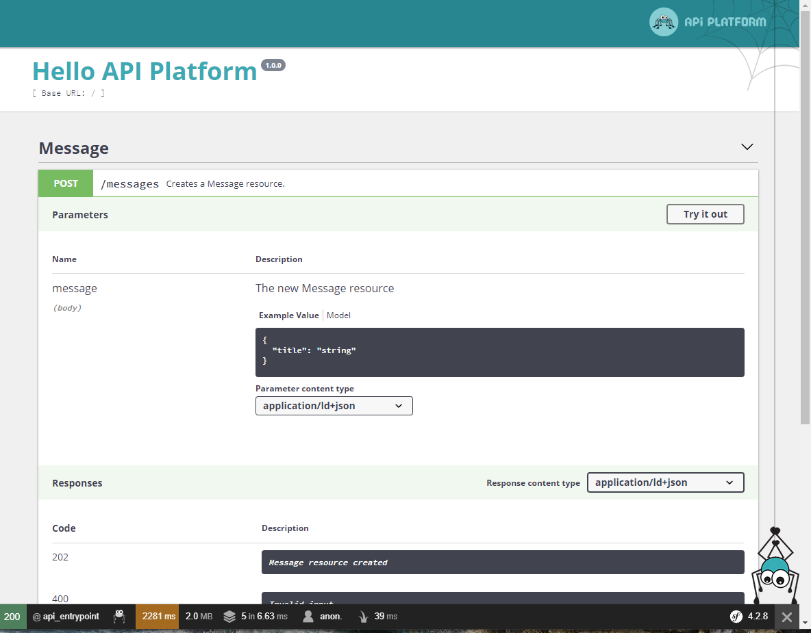
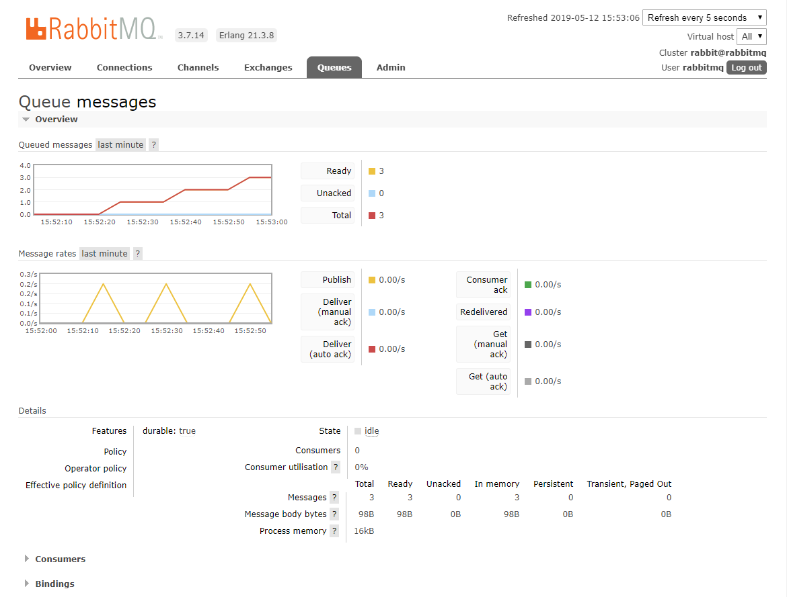
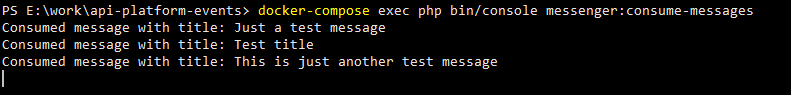

# api-platform-event-service
Service to push events to a queue using [API Platform](https://api-platform.com/docs/), [Symfony messenger](https://symfony.com/doc/current/components/messenger.html) and RabbitMQ (https://www.rabbitmq.com/)

## Requiments
- [Docker](https://docs.docker.com/) & [Docker-compose](https://docs.docker.com/compose/)

## Installation
```docker-compose up```

## Usage
The Swagger API documentation and client should be accessible via ```http://localhost:8080```



By doing a POST request to /messages endpoint the message will be pushed to the RabbitMQ container.

The RabbitMQ management console is available at ```http://localhost:15672```



To consume the messages ```docker-compose exec php bin/console messenger:consume-messages``` will invoke the MessageHandler


